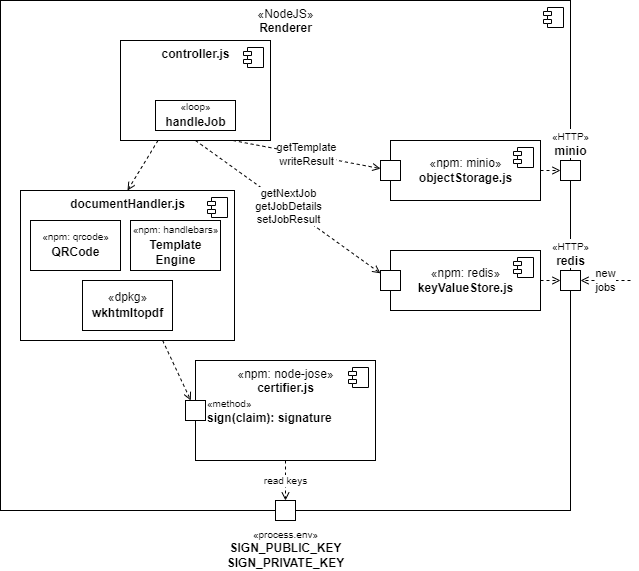

= Architecture
:toc:

:sectnums:
:sectnumlevels: 2

== Introduction & Goals
This document is a written in https://asciidoctor.org/[Asciidoc] and follows the https://arc42.org/[arc42] template.

=== Requirements Overview
The goal of this system is to provide a generic service that can render a _pdf_ document from a _claim_ and a _template_. 
The resulting document should contain a _cryptographic signature_ that can be validated even when the document is printed (as opposed to just digitally signing the binary file).

=== Quality Goals
While the implementation is only on a prototype level, the architecture of the system should be usable in real world scenarios.

[cols="1,5,20"]
|===
|# |Name |Description

|1 |Learning | This project is mostly for learning about the cryptographic methods and kubernetes.
|2 |Secure | The cryptographic scheme should be secure in priniple even if the concrete implementation as an MVP takes shortcuts.
|3 |Scalable | The system should be designed to scale in a large inhouse cloud system.
|4 |Generic | The system should be generic in the sense that multiple different use cases can be supported with little additional effort.
|===

=== Stakeholders
[cols="1,5"]
|===
|Stakeholder |Expections

|Developer | Wants to learn technologies and concepts.
|Service Customers | Want to know how to integrate the service into a existing IT landscape.
|===

== Constraints

|===
| Constraint | Description

| Local Development | The system is not deployed to any cloud services
| Kubernetes | Kubernetes is set as the target system for learning purposes
|===
== Context & Scope
=== Business Context
.Use Case Diagram

.Business Context
image:business-context.drawio.png[Business Context]

=== Technical Context
The api description can be found in the link:/doc/certify.openapi.yaml[repository] and can be rendered with the https://editor.swagger.io/[swagger editor].

== Solution Strategy
The system uses the https://redis.io/docs/manual/pubsub/[redis pubsup] mechanism as a simple work queue. That way the technologically complex rendering process is isolated and can be changed later. It also allowes independend scaling of the resource demanding task.

The claim is stringified and a https://www.rfc-editor.org/rfc/rfc7515[JSON Web Signature (JWS)] is generated. This signature is embedded in the resulting pdf document both in plain text and as a convinient QRCode leading to a verification endpoint.

== Building Block View
=== Building Block Level 1
.Box View L1 Whitebox
image:box-view-L1-whitebox.drawio.png[L1 Whitebox]

[cols="1,5"]
|===
|Component (Reference) | Description

|link:/client[Sample Client]
|A static website consuming the API endpoints and giving a minimalistic GUI for testing users.
|link:/api[API Server]
|An express server providing the external API and forwarding new jobs to the queue.
|link:/renderer[Renderer]
|A nodeJS application subscribing to the queue for new jobs and rendering them.
|https://github.com/minio/minio/tree/master/helm/minio[Object Store]
|An S3 like object storage included as a helm subchart.
|https://bitnami.com/stack/redis/helm[Redis]
|A key value store included as a helm subchart.
|===
=== Building Block Level 2

[cols="1,5"]
|===
|Component (Reference) | Description

|link:/renderer/src/controller.js[controller.js]
|The main loop of the server, subscribing to the queue, starting the rendering process and writing the result back into the queue and the object storage.
|link:/renderer/src/documentHandler.js[documentHandler.js]
|The rendering component using the npm libraries https://www.npmjs.com/package/qrcode[qrcode] to generate a QR code image, https://www.npmjs.com/package/handlebars[handlebars] as the html template engine. For rendering to pdf it uses the debian package https://wkhtmltopdf.org/[wkhtmltopdf] installed on the docker container level.
|link:/renderer/src/certifier.js[certifier.js]
|The component responsible signing a json document. Using the npm library https://github.com/cisco/node-jose[node-jose] generating https://www.rfc-editor.org/rfc/rfc7515[JSON Web Signatures (JWS)].
|link:/renderer/src/objectStorage.js[objectStorage.js]
|A facade for the official https://www.npmjs.com/package/minio[minio SDK].
|link:/renderer/src/keyValueStore.js[keyValueStore.js]
|A facade for the official https://www.npmjs.com/package/redis[redis SDK].
|===
== Runtime View
=== Signing
image:runtime-signing.png[Runtime Signing]

=== Verification
TODO: Add Runtime view for verification

== Deployment View
image:deployment.drawio.png[Deployment]

== Crosscutting Concepts
=== Persistence

.Datamodel of Redis https://redis.io/docs/data-types/hashes/[hashes] `jobs:$uuid`
[cols="1,5"]
|===
|     field     |              type               

| `date`        | `string` ( iso8601 )                
| `status`      | `string` ( `WAITING,RENDERING,DONE` ) 
| `documentKey` | `string`                          
| `claim`       | `string` ( json )                   
| `pdfUrl`      | `string`                          
|===

The queue is a Redis https://redis.io/docs/data-types/lists/[list] under the key `queue`.

=== Cryptography
TODO: describe cryptography thoughts

=== Logging
TODO: describe logging

== Architectual Decisions

[cols="2,10"]
|===
| Title | Description 

| No Certificates 
| The cryptographic implementation only uses public/private key pairs instead of a PKI. 

This will require a refactoring when a full tenant system is implemented.

The reason for this choice was ease of implementation.
| Redis as Queue 
| Instead of using a full fletched queue system like RabbitMQ or Kafka, the Redis PubSub mechanism is used.

It is likely that future extensions of the system require a more robust feature set on the queue. Refactoring the system to use a different queue should be doable with moderate effort.

Again, the main reason for the decision was ease of implementation, specifically avoiding additional components to be deployed.
|===

== Quality Requirements

== Risks and Technical Debt

[cols="1,5,5"]
|===
| Title | Description | Mitigation

| No Certificates 
| The cryptographic implementation only uses public/private key pairs instead of a PKI.
| When moving to one key per document, the switch to a PKI has to be made. The crypto library https://github.com/cisco/node-jose#managing-keys[node-jose] supports PKIX X.509 certificates.

| No Auth 
| Currently all endpoints, specifically the sign endpoint is not protected in any way. 
| The used HTTP server library https://expressjs.com/[express] has OIDC supporting https://github.com/auth0/express-openid-connect[middleware] available.

|===