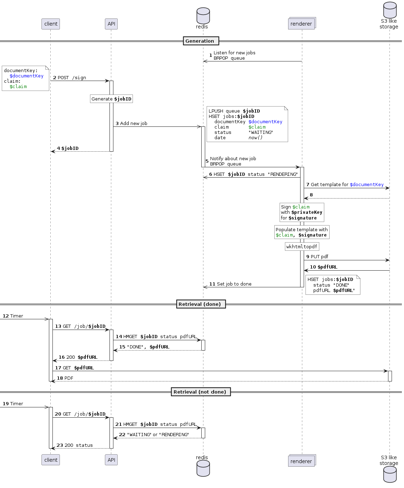
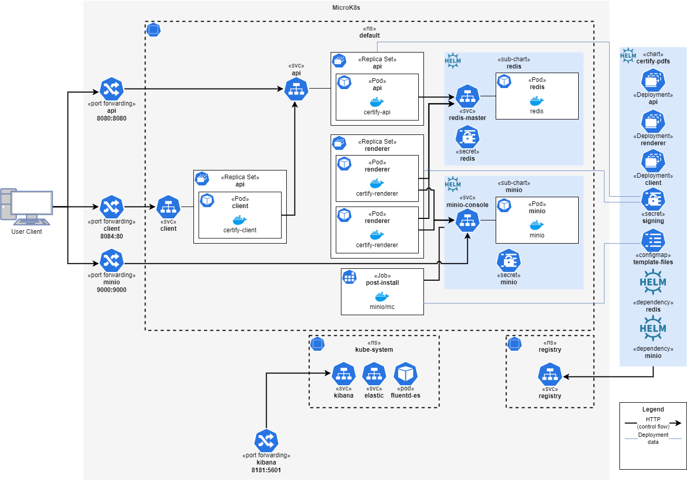

= Architecture
:toc:

:sectnums:
:sectnumlevels: 2

== Introduction & Goals
This document is a written in https://asciidoctor.org/[Asciidoc] and follows the https://arc42.org/[arc42] template.

=== Requirements Overview
The goal of this system is to provide a generic service that can render a _pdf_ document from a _claim_ and a _template_. 
The resulting document should contain a _cryptographic signature_ that can be validated even when the document is printed (as opposed to just digitally signing the binary file).

=== Quality Goals
While the implementation is only on a prototype level, the architecture of the system should be usable in real world scenarios.

[cols="1,5,20"]
|===
|# |Name |Description

|1 |Learning | This project is mostly for learning about the cryptographic methods and kubernetes.
|2 |Secure | The cryptographic scheme should be secure in priniple even if the concrete implementation as an MVP takes shortcuts.
|3 |Scalable | The system should be designed to scale in a large inhouse cloud system.
|4 |Generic | The system should be generic in the sense that multiple different use cases can be supported with little additional effort.
|===

=== Stakeholders
[cols="1,5"]
|===
|Stakeholder |Expections

|Developer | Wants to learn technologies and concepts.
|Service Customers | Want to know how to integrate the service into a existing IT landscape.
|===

== Constraints

|===
| Constraint | Description

| Local Development | The system is not deployed to any cloud services
| Kubernetes | Kubernetes is set as the target system for learning purposes
|===
== Context & Scope
=== Business Context
.Use Case Diagram
image:business-case.drawio.png[Business Case]

.Business Context

== Solution Strategy
The system uses the https://redis.io/docs/manual/pubsub/[redis pubsup] mechanism as a simple work queue. That way the technologically complex rendering process is isolated and can be changed later. It also allowes independend scaling of the resource demanding task.

== Building Block View
=== Building Block Level 1
.Box View L1 Whitebox
image:box-view-L1-whitebox.drawio.png[L1 Whitebox]

=== Building Block Level 2
image:box-view-L2-renderer.drawio.png[L2 Renderer]

== Runtime View
.Runtime Signing

== Deployment View

== Crosscutting Concepts
=== Cryptography