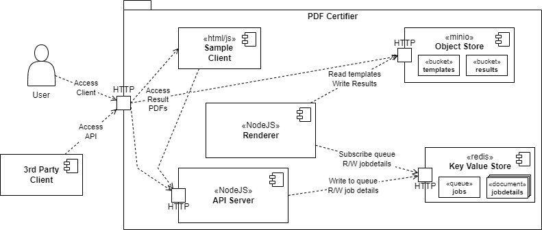

# Introduction




## Redis

### Data Model

* `queue` is a Redis `list` of uuids (strings)
* `jobs:<uuid>` is a hashset containing the following keys

|     key     |              type               |
| ----------- | ------------------------------- |
| date        | string (iso8601)                |
| status      | string (WAITING,RENDERING,DONE) |
| documentKey | string                          |
| claim       | string (json)                   |
| pdfUrl      | string                          |

# Start up
Using docker-compose, the whole system can be started with 

```sh
sh ./start.sh
```

## Before Startup
### Crypto
Generate a new key pair with 

```sh
openssl ecparam -name prime256v1 -genkey -noout -out ./deployment/certify-pdfs/secrets/ec256-key-pair.pem
openssl ec -in ./deployment/secrets/ec256-key-pair.pem -pubout -out ./deployment/certify-pdfs/secrets/ec256-public.pem
cat ./deployment/certify-pdfs/secrets/ec256-key-pair.pem | base64 -w 0 > ./deployment/certify-pdfs/secrets/ec256-key-pair.pem.base64
cat ./deployment/certify-pdfs/secrets/ec256-public.pem | base64 -w 0 > ./deployment/certify-pdfs/secrets/ec256-public.pem.base64
```
and add the base64 parts to the `deployments/.env`.


# Kubernetes / Helm

```sh
# run once to install dependencies
cd deployment/
helm dependency update ./certify-pdfs
```

```sh
# deploy locally
cd deployment/
sh deploy.sh
```

```sh
# Dashboard
microk8s dashboard-proxy
# Logging Proxy
microk8s.kubectl port-forward -n kube-system service/kibana-logging 8181:5601

# Minio Dashboard
microk8s kubectl port-forward $(microk8s kubectl get pods -o=name | grep certify-pdfs-minio-[^p]) 9001:9001

# Minio values
microk8s kubectl port-forward $(microk8s kubectl get pods -o=name | grep certify-pdfs-minio-[^p]) 9000:9000

# Certifier API
microk8s kubectl port-forward $(microk8s kubectl get pods -o=name | grep certify-pdfs-api ) 8080:8080

# client
microk8s kubectl port-forward $(microk8s kubectl get pods -o=name | grep cI think I ertify-pdfs-client ) 8084:80
```